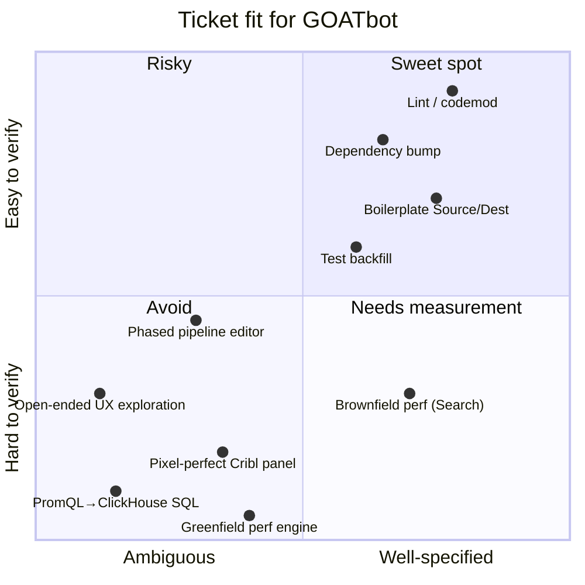

# GOATbot vs Local Interactive — at a glance

When should you send a ticket to **GOATbot** (Cribl's autonomous PR-generating bot) and when should you just open Claude Code and build it yourself? Same model under the hood — the difference is the interaction model, not capability.

Look at where your ticket falls on this chart first. Then drill into whichever detail doc matches your situation.

---

## Where your ticket fits

**Upper-right** → ship via GOATbot. **Anywhere else** → at minimum, invest in measurement infrastructure first; for the bottom-left, just build it yourself in Claude Code.

---

## The five things to remember

1. **The worker doesn't talk to deployed Cribl.** No VPN, no SSO, no service credentials for any Cribl tenant. A repo *could* ship a local-spinup script (the `.goatbot/repro.sh` convention proposed in [AI-3444](https://taktak.atlassian.net/browse/AI-3444)) since Cribl publishes Docker images — but the team explicitly considered building "Playwright against a seeded Cribl stack" and deferred it. So in practice today, work that requires real Cribl to verify gets verified only after the worker exits, by a human (review pods from PR #157, build-env handoff, or `deploy-pr-image-to-ecr`).
2. **The worker is single-shot.** Each invocation is a fresh container. Artifacts that persist across respawns — `plan.md`, PR comments, the diff — are readable by the next worker, but the *reasoning* behind decisions (what was considered, what was rejected, why) is gone.
3. **For greenfield work, the worker is grading its own homework.** When the worker writes both the implementation and the tests, green CI just confirms the worker's mental model — it doesn't validate behavior. Verification has to happen by a human checking out the branch and exercising it against real Cribl. Brownfield work with existing tests is fine — those tests *are* an independent oracle.
4. **Chat would close the *clarification* gap, not the *verification* gap.** A bidirectional Slack loop helps with phasing and ambiguity. It does nothing for runtime access or perception ceilings.
5. **"PRs as cattle" works for workers, not features.** *(Framing.)* Ephemeral workers are the right design. But features need pets — designs, decisions, and verification artifacts that persist across worker lives, otherwise each respawn re-derives.

---

## Drill in

- **[Three case studies](https://taktak.atlassian.net/wiki/spaces/~712020a1b4f03e3d0741719d2c39a90abf907a/pages/5790729243/cases)** — phased features, pixel-perfect Cribl UI, PromQL→ClickHouse SQL conversion. Where GOATbot specifically struggles, and why.
- **[The runtime gap and the oracle bootstrap](https://taktak.atlassian.net/wiki/spaces/~712020a1b4f03e3d0741719d2c39a90abf907a/pages/5791776769/runtime-and-oracles)** — why the worker can't reach Cribl, why "use a benchmark harness" is question-begging for greenfield work, and which Cribl tasks this rules out.
- **[Mitigations](https://taktak.atlassian.net/wiki/spaces/~712020a1b4f03e3d0741719d2c39a90abf907a/pages/5791809537/mitigations)** — eight concrete things that would expand GOATbot's range.
- **[The chat question](https://taktak.atlassian.net/wiki/spaces/~712020a1b4f03e3d0741719d2c39a90abf907a/pages/5791220597/chat)** — what bidirectional chat would and wouldn't fix, and a worked example of moving pixel-perfect work into the sweet spot.

---

## One-line summary

GOATbot is the right tool for the upper-right of the chart and the wrong tool for everything else **until** you give the worker real-Cribl access and real oracles. Use Claude Code locally for the rest.
