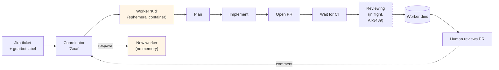
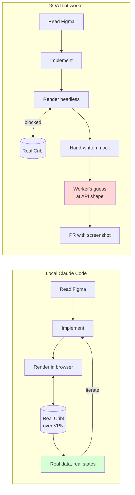
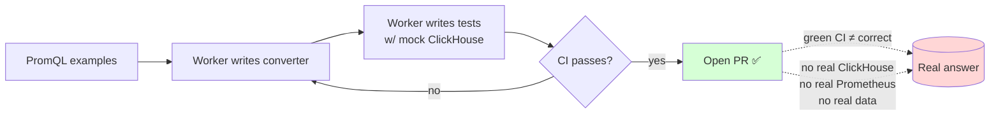

# Three case studies — where GOATbot struggles

Back to **[overview](https://taktak.atlassian.net/wiki/spaces/~712020a1b4f03e3d0741719d2c39a90abf907a/pages/5790499710/README)** · Next: **[runtime gap and oracles](https://taktak.atlassian.net/wiki/spaces/~712020a1b4f03e3d0741719d2c39a90abf907a/pages/5791776769/runtime-and-oracles)**

---

## Quick context: how GOATbot works today

> **Note on state:** the `Reviewing` advisory self-review is *in flight* via [AI-3439](https://taktak.atlassian.net/browse/AI-3439) / PR #196, not shipped today. Per the [Automated Code Review design doc](https://taktak.atlassian.net/wiki/spaces/TPM/pages/5743509524): *"Today, once CI passes, the PR transitions to 'In Review' and a human is notified. There is no second pass by Claude to review the bot's own output."* The `gb-pr-review` skill is written but currently only used in the (also in-flight) `goatbot:review` label flow ([AI-3652](https://taktak.atlassian.net/browse/AI-3652)).

- Workers are **single-shot, ephemeral containers** — "PRs as cattle, not pets"
- Pre-execution input = Jira ticket description, comments, attachments
- Mid-execution input = **none** (worker runs to completion)
- Post-PR input = PR comments (Coordinator respawns a worker to address them)
- Escape hatch = build env handoff (human takes over locally)

The structural consequence: **every clarification is a commit boundary and a worker respawn**, with no memory of why prior decisions were made.

---

## Case 1 — Phased feature in `cribl/cribl`

**Example:** A multi-phase feature touching schema → API → frontend → migration.

**Local Claude Code:** Propose a plan, user redirects in one sentence, agent adapts. Phase boundaries negotiable in real time.

**GOATbot:** Worker commits to a phasing plan up front, encodes it into PRs, lives with the decision. Re-slicing means abandoning open PRs and reviewer attention already spent.

```mermaid
stateDiagram-v2
    direction LR
    [*] --> goatbot_label_added
    goatbot_label_added --> Plan
    Plan --> Phase1_PR
    Phase1_PR --> Worker_Dies
    Worker_Dies --> Wait_For_Human: PR sits 10.8 days avg
    Wait_For_Human --> PR_Comment: "actually we need X first"
    PR_Comment --> Worker_Respawn: no memory of phase 1 reasoning
    Worker_Respawn --> Phase1_Rework
    Phase1_Rework --> [*]: previous review effort wasted
```

**Specific failures:**

- **No memory across phases.** Phase 2's worker doesn't remember why phase 1's worker made a particular choice. It re-derives, sometimes incorrectly.
- **Reviewer queue is the bottleneck.** Per the "Removing the PR-Review human bottleneck" doc, the Search team backlog averages 10.8 days per PR with 17 non-draft PRs in queue.
- **Phasing is the ambiguous part.** A spec can say "build feature X" without prescribing the phasing. The Jira ticket cannot encode the trade-offs the worker discovers mid-implementation.
- **Hidden cross-phase invariants.** A decision in phase 1 that constrains phase 3 is invisible to the reviewer of phase 1.

---

## Case 2 — Frontend UI matching Figma in the `cribl` repo

**Example:** Build a Cribl panel that has to match a Figma mockup pixel-faithfully.

**Local Claude Code:** Read Figma via MCP, render in browser against a real Cribl instance (auth, real data, real loading states), screenshot, compare against design, iterate. User can point: "this padding here, should match that one."

**GOATbot:** Worker has Figma access. Renders headlessly. **Cannot run against a real Cribl backend** — no VPN, no SSO, no credentials. Screenshots in the PR are of a UI talking to **mocks the worker wrote** against **fixtures the worker invented from the OpenAPI spec**.

**Specific failures:**

- **Mock-vs-real drift.** The mock matches the OpenAPI spec; real Cribl has undocumented quirks the spec doesn't capture.
- **No real loading / error / empty states.** With a mock, every request succeeds in 5ms. The 4-second slow case, the 502, the partial response, the 50k-row dataset — never seen.
- **Pixel-perception ceiling.** Even with a screenshot loop and two verifiers, models miss small visual deltas because perception is correlated across LLM-based judges. Pixel-diff with a hard threshold against the Figma export is the only honest oracle.
- **Prose feedback in PR comments is lossy.** "Make the card a bit tighter" is fine when you're pointing; it's a guessing game in a Bitbucket comment.
- **Interaction states invisible in PR screenshots.** Hover, focus, selected, drag-and-drop — the reviewer can't see them without checking out the branch.

---

## Case 3 — PromQL → ClickHouse SQL conversion (the metrics store)

**The system:** Cribl's new metrics store is backed by ClickHouse, with a Go-based PromQL engine. The PromQL → SQL → ClickHouse pipeline lives in **`@cribl/metrics-core`** (ANTLR parser + SQL builders + schema generator + alert evaluation), per the [Customer Metrics Service architecture](https://taktak.atlassian.net/wiki/spaces/~71202001839dde132d425e8d1d5dd81dcdf3e4/pages/5589402032). A converter change has to translate every PromQL construct to equivalent ClickHouse SQL that runs against the live schema and returns the same answer Prometheus would.

**Local Claude Code:** Stand up a real ClickHouse + a real Prometheus (or the Go PromQL engine on `:9090`), ingest the same metrics into both, run the PromQL query against Prometheus and the generated SQL against ClickHouse, compare results, measure timing, iterate on edge cases interactively (`rate()` over an empty range, `histogram_quantile` with sparse buckets, `@` modifier, label re-matching).

**GOATbot:** Worker writes the converter, writes tests, opens a PR. The tests use a mock ClickHouse and an imagined Prometheus — both encoded with the worker's same mental model. **The worker is grading its own homework**, and the reviewer reading the diff has no better oracle than the worker did.

### What the worker can't verify

The three you named, plus the ones that bite hardest in practice:

1. **The generated SQL is even valid against the live ClickHouse.** The worker's mock accepts whatever the worker emits. Real ClickHouse has version-specific syntax, function-availability differences, and parser strictness the mock doesn't model. Green CI says nothing about whether ClickHouse will actually run the query.
2. **The result matches Prometheus on the same data.** This is the only correctness criterion that matters, and it requires *both* engines running over identical data. Without that, the worker can't tell if `rate()` is windowed correctly, if step alignment matches Prometheus's evaluation grid, if NaN propagation matches, if staleness handling matches, if empty-range behavior matches.
3. **The generated SQL is performant.** A naive but correct translation can be 1000× slower than a tuned one. ClickHouse perf depends on partitioning keys, ordering keys, materialized views, and the query plan — all of which are properties of the *live* schema and *live* data shape. The worker has no signal on any of this.
4. **The translation respects the live schema.** Column names, types, partitioning, indexes, and any pre-aggregation materialized views are properties of the deployed metrics store. The worker can read a schema doc but can't see what's actually there today, especially as it evolves.
5. **High-cardinality label sets don't blow up the query plan.** PromQL queries that group by a high-cardinality label produce SQL `GROUP BY` plans that explode in production but pass on toy fixtures. Invisible without realistic data volumes.
6. **PromQL semantic edge cases survive translation.** `rate()`, `irate()`, `increase()`, `histogram_quantile()`, range vectors, instant vectors, `@` modifier, subqueries, scalar-vs-vector type coercion, label matching with `=~`/`!~`, sparse vs dense series — each has subtle semantics that a self-written test corpus rarely exercises completely. The agent that wrote the converter has the same blind spots as the agent writing the tests.
7. **Concurrency / resource behavior under load.** Query timeout, memory limits, what happens to in-flight queries when the user navigates away — only observable on a real cluster.
8. **Error paths produce useful errors.** When a PromQL query is untranslatable or the SQL fails, what does the user see? The worker can write an error path but can't verify it's actually surfaced and actionable.

### Why this is the canonical "avoid without oracles" task

The unit of correctness is **a property of two systems running side-by-side over real data**. There is no version of "more careful prompting" that fixes that. The only honest path is to give CI access to a real ClickHouse and a real Prometheus seeded with a curated query corpus that has known-correct outputs — and even then, the corpus has to come from somewhere outside the worker (otherwise the worker is grading itself again).

See [runtime gap and oracles](https://taktak.atlassian.net/wiki/spaces/~712020a1b4f03e3d0741719d2c39a90abf907a/pages/5791776769/runtime-and-oracles) for why this is structural, not a tooling issue.

---

Back to **[overview](https://taktak.atlassian.net/wiki/spaces/~712020a1b4f03e3d0741719d2c39a90abf907a/pages/5790499710/README)** · Next: **[runtime gap and oracles](https://taktak.atlassian.net/wiki/spaces/~712020a1b4f03e3d0741719d2c39a90abf907a/pages/5791776769/runtime-and-oracles)**
